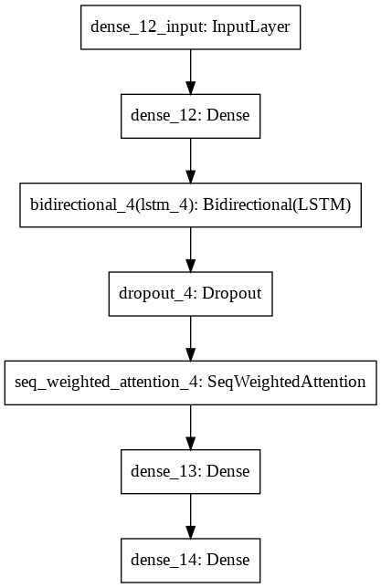

# Engagement-Tracking-using-Deep-neural-networks
Detecting the engagement levels gives a hugehelp  to  measure  the  quality  and  attention  indifferent situations.  For learning process, stu-dent  performance  and  class  quality  could  beevaluated through the levels.  In this task, weproposed a neural network within the attentionpooling mechanism to achieve a more accuratepredictions on the engagement scales

## Implentation
Firstly we will preprocess the data start-ing with the video set’s cutting and down sampling.Using OpenFace, an opensource face analysis im-plementation, we continue with the feature extrac-tion. Following that, the extracted feature data willbe prepared as input for the model to be trained.The model is based on a neural network, whichmonitors the engagement in the end
 
### Data Preprocessing
To adapt the data into a machine learning modelthe preprocessing of the data is necessary. A vectorwise data representation is an ideal input for the model for further processing. We divided the pre-processing into two sub processes. The first stepwill be to cut and downsample the videos and thesecond step will cover the feature extraction

### Cutting and Downsampling

All of the videos were downsampled to 10 framesper second to speed up the computation and savespace. Furthermore, only the video portions from00:30 to 4:30 were used for interaction predictionto remove any unintended effects from the begin-ning and end of the video. Here for the pythonlibrary ffmpeg was used

### Feature Extraction

In the past years more and more face detectionand analysis opensource software become popular.For the extraction of the Features we used Open-Face.  OpenFace is an open-source platform that incorpo-rates facial behaviour analysis algorithms such asfacial landmark identification, head pose tracking,eye gaze tracking, and estimation of facial ActionUnits, which are good intuitive cues about the sub-jects’ attention. For each frame, Open-Face was used to extract a 31-dimensional feature
- Head Pose: It is a 6-dimensional feature col-lection that describes the position of the headand its rotation in radians around the x, y, andz axes.
- Eye Gaze: It comprises two 3-dimensionaleye gaze dircetion vectors for both eyes andone 2-dimensional averaged eye gaze direc-tion in radians for both eyes. The eye gazefeatures have a complete dimension of 8
- Facial Action Units (AUs): We use the de-tected strength (from 0 to 5) of these extractedAUs to form a 17-dimensional feature vector

The extracted 31-dimensional frame-level fea-tures were then used to create segment-level fea-tures for each video. The creation is divided into 3steps:
- The original features were concatenated withthe 1st and 2nd order delta coefficients, yield-ing a 93-dimensional feature vector for eachframe
- We group 20 frames into one segment andapply 6 moment functions to each. The mo-ment functions we use are min, max, standarddeviation, kurtosis and skewness. For this pur-pose we assembled a sliding window. Thissequentially goes through the frames, com-bines 20 frames into one segment, applies the6 moment functions and recursively take thenext 20 frames. As a result, each segment’scumulative function vector consists 31* 3* 6= 558 attributes. Then we normalized all ofthe segment-level characteristics to zero meanand unit variance
- For computational efficiency, we used Prin-cipal Component Analysis (PCA) from thepython sklearn library to reduce the normal-ized features to a lower dimension of d. Thefirst principal variable is the function that in-duces the most variation. The second princi-pal variable is the function that is responsiblefor the second largest variation, and so on

## Neural Network

Recurrent Neural Networks (RNN) models haverecently become popular for automatically learninguseful features from sequential results. A RNNis a type of neural network with loops that allowdata to be stored within the network. RNNs usetheir logic from past interactions to predict futureevents. Recurrent models are useful because theycan be applied to sequence vectors, allowing tohandle more complex tasks.Following this pattern, we investigated the use ofRNN models for setting up our AI. RNNs that usegates to monitor the flow of information abstractedfrom a sequence are known as Long Short-TermMemory (LSTM). We used Bi-directional LSTM(BLSTM) in this study to help maintain thetemporal dynamic characteristics. TensorFlow andKeras are used to implement these NN models andthe attention function

## Training 

## Conclusion and Future Work

In this project, we attempted to incorporate a inter-action monitoring model based on the paper from(Cheng Chang , Cheng Zhang, Lei Chen, YangLiu).This paper (Abhay Gupta, Arjun D’Cunha, KamalAwasthi and Vineeth Balasubramanian) presentsDAiSEE, a dataset designed to aid research anddevelopment in the field of user interaction identifi-cation. The DAiSEE dataset, which contains videorecordings of subjects in an e-learning environmentannotated with crowdsourced labels for engage-ment, anger, uncertainty, and boredom. The datasetcaptures “in the wild” settings that are common inthe real world, and it will be made public, alongwith the crowd’s individual annotations, to encour-age open study.(Abhay Gupta, Arjun D’Cunha, Ka-mal Awasthi and Vineeth Balasubramanian)The engagement levels from the DAiSEE datasetcan be easily applied to our model. It has in total 4levels like we use to train our model. The resultsof this massive dataset may be used to improveaccuracy

